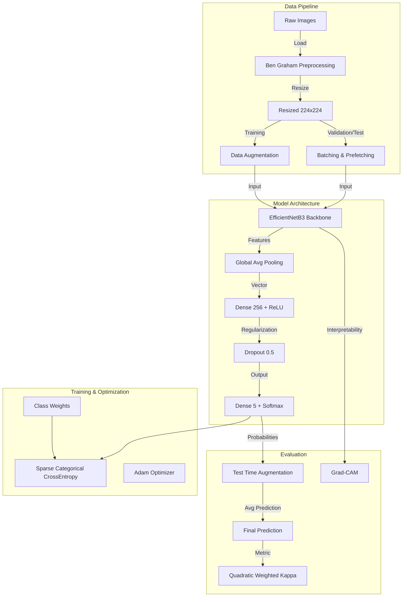

# Deep Learning Project Report: Diabetic Retinopathy Detection

## Introduction
This report details the technical implementation of a Deep Learning system designed to detect and classify Diabetic Retinopathy (DR) from retinal fundus images. The goal is to accurately assign a diagnosis grade (0 to 4) to each image, assisting ophthalmologists in early detection.

## System Architecture

The following schema illustrates the end-to-end data flow and system components:

## Detailed Technical Analysis

### 1. Data Preprocessing: "Ben Graham's Method"
**Why?**
Retinal images often come with varying lighting conditions and large, uninformative black borders. These artifacts can confuse the model and waste computational resources on processing empty space.

**What?**
We employ a technique popularized by Ben Graham (a Kaggle Grandmaster) to improve data quality.

**How?**
1.  **Convert to Grayscale**: To easily identify pixel intensity.
2.  **Thresholding**: Isolate the circular fundus from the black background.
3.  **Cropping**: Tightly crop the image to the bounding box of the fundus.
4.  **Result**: The model sees only the relevant retinal structure, standardized across all images.

### 2. Data Augmentation
**Why?**
Deep learning models are data-hungry and prone to overfitting (memorizing training data). Real-world images may be rotated or have different lighting.

**What?**
We artificially expand the training dataset by creating modified versions of existing images.

**How?**
We use `tf.image` operations within the `tf.data` pipeline:
*   **Geometric**: Random horizontal/vertical flips and 90-degree rotations. This teaches the model that the orientation of the eye does not change the disease grade.
*   **Photometric**: Random adjustments to brightness, contrast, and saturation. This makes the model robust to images taken with different cameras or lighting settings.

### 3. Model Architecture: EfficientNetB3
**Why?**
We need a powerful feature extractor that balances performance (accuracy) with computational efficiency.

**What?**
We use **EfficientNetB3**, a state-of-the-art Convolutional Neural Network (CNN) pre-trained on ImageNet.

**How?**
*   **Transfer Learning**: We initialize the backbone with weights learned from millions of general images. This allows the model to recognize basic shapes and textures immediately.
*   **Custom Head**: We replace the original top layers with a custom classifier:
    *   `GlobalAveragePooling2D`: Compresses spatial features into a single vector.
    *   `Dense(256, ReLU)`: A fully connected layer to learn specific DR features.
    *   `Dropout(0.5)`: Randomly turns off neurons during training to force redundant feature learning (regularization).
    *   `Dense(5, Softmax)`: Outputs the probability for each of the 5 severity classes.

### 4. Training Strategy
**Why?**
Training a deep network from scratch is difficult and unstable. We need a strategy to adapt the pre-trained weights to our specific medical task gently.

**What?**
A **Two-Phase Training** approach.

**How?**
*   **Phase 1 (Warmup)**: The EfficientNet backbone is **frozen** (weights are not updated). We only train the custom head. This prevents the random initialization of the head from destroying the pre-trained backbone features.
*   **Phase 2 (Fine-tuning)**: The backbone is **unfrozen** (weights are updated). We train the entire network with a very low learning rate (`1e-5`) to fine-tune the feature extractors for retinal nuances without losing general knowledge.

### 5. Handling Class Imbalance
**Why?**
Medical datasets are typically imbalanced; there are many more healthy eyes (Class 0) than severe cases (Class 4). A standard model would just guess "Healthy" to maximize accuracy.

**How?**
We use **Class Weights**. During training, the loss function penalizes mistakes on rare classes (severe DR) much more heavily than mistakes on common classes. This forces the model to pay attention to the minority classes.

### 6. Test Time Augmentation (TTA)
**Why?**
A single prediction might be noisy or wrong due to a specific crop or angle.

**What?**
Making multiple predictions for the same image and averaging them.

**How?**
At inference time, we generate 5 augmented versions (e.g., flipped, rotated) of the test image. The model predicts on all of them, and we average the probabilities. This "ensemble of one" approach significantly increases reliability and accuracy.

### 7. Evaluation Metric: Quadratic Weighted Kappa (QWK)
**Why?**
Simple accuracy is misleading for this task. Mistaking Mild DR (Grade 1) for Moderate DR (Grade 2) is less severe than mistaking Prolifertive DR (Grade 4) for Healthy (Grade 0).

**How?**
QWK scores the agreement between predictions and truth, penalizing large discrepancies (e.g., predicting 0 when truth is 4) quadratically. A score of 0.0 is random guessing; 1.0 is perfect agreement. This matches the way human experts are evaluated.

### 8. Interpretability: Grad-CAM
**Why?**
"Black box" models are hard to trust in healthcare. We need to know *where* the model is looking.

**What?**
Gradient-weighted Class Activation Mapping (Grad-CAM).

**How?**
We compute the gradients of the specific class score with respect to the final convolutional feature maps. This generates a heatmap that highlights the regions of the image (e.g., hemorrhages, lesions) that were most important for the model's decision.
