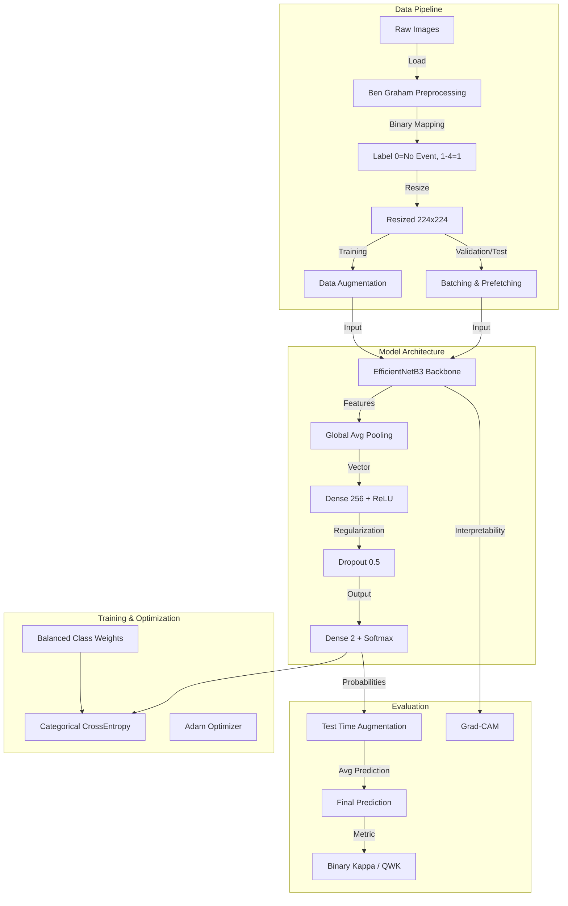

# Deep Learning Project Report: Binary Diabetic Retinopathy Detection

## Introduction
This report details the technical implementation of a Deep Learning system designed for the binary classification of Diabetic Retinopathy (DR). Unlike the fine-grained 5-class grading, this pipeline focuses on a screening logic: distinguishing between **Healthy** (Grade 0) and **Diseased** (Grades 1-4). This approach is critical for automated triage and identifying patients who require specialist intervention.

## System Architecture

The following schema illustrates the end-to-end data flow and system components for the binary pipeline:

## Detailed Technical Analysis

### 1. Data Preprocessing & Binary Mapping
**Why?**
The binary pipeline simplifies the clinical task to a "referral" model. Instead of specific grades, we care about the presence of any pathology.

**What?**
*   **Ben Graham's Method**: Standardized cropping and lighting correction (as described in the 5-class report).
*   **Label Mapping**: 
    - Grade 0 (No DR) $\rightarrow$ **Class 0 (No Event)**
    - Grades 1, 2, 3, 4 (DR) $\rightarrow$ **Class 1 (Event)**

**How?**
The `train_binary.py` script applies a lambda function to the dataframe before training to unify all diseased categories. This reduces label noise and provides a clearer signal for whether a patient needs to see a doctor.

### 2. Data Augmentation
**Why?**
To ensure the model generalizes to different cameras and clinical settings.

**What & How?**
We use `tf.image` operations for random horizontal/vertical flips, 90-degree rotations, and adjustments to brightness and contrast. This forces the model to learn invariant features of the retina rather than specific image orientations or lighting conditions.

### 3. Model Architecture: EfficientNetB3
**Why?**
EfficientNetB3 offers an optimal scaling of depth, width, and resolution, providing high accuracy with fewer parameters than traditional heavy architectures like ResNet152.

**How?**
*   **Transfer Learning**: Pre-trained on ImageNet to leverage universal visual features.
*   **Binary Head**:
    *   `GlobalAveragePooling2D`: Distills spatial information.
    *   `Dense(256, ReLU)`: Captures DR-specific features.
    *   `Dense(2, Softmax)`: Specifically configured for 2 output classes.

### 4. Two-Phase Training Strategy
We employ a robust training regimen to protect pre-trained weights:
1.  **Phase 1 (Frozen Backbone)**: Train only the top layers at a higher learning rate (`1e-3`). This "settles" the random head weights.
2.  **Phase 2 (Fine-tuning)**: Unfreeze the EfficientNet backbone and train at a very low learning rate (`1e-5`). This allows the entire network to adapt to subtle retinal textures (like microaneurysms) without catastrophic forgetting.

### 5. Handling Class Imbalance
Even in binary classification, the dataset may be skewed. We use **Balanced Class Weights** calculated from the training set distribution to ensure the loss function treats a mistake on a "Diseased" case as significantly as a "Healthy" one.

### 6. Test Time Augmentation (TTA)
During inference, each test image is augmented (3 steps), and the results are averaged. This stabilizes the prediction and yields a more reliable confidence score, crucial for medical decision-making.

### 7. Evaluation & Metrics
*   **Binary Kappa (QWK)**: Measures agreement beyond chance. In a binary context, this is equivalent to Cohen's Kappa.
*   **Precision/Recall**: Highly important in DR screening. We aim for high Recall (not missing diseased patients) while maintaining acceptable Precision (avoiding over-referral).
*   **Confusion Matrix**: Visualized in `outputs_binary/confusion_matrix.png` to analyze error types (False Positives vs. False Negatives).

### 8. Interpretability: Grad-CAM
Using Gradient-weighted Class Activation Mapping, we generate heatmaps (saved in `outputs_binary/gradcam_sample_X.png`) that highlight the clinical features (lesions, exudates) used by the model for its decision. This provides transparency for clinical validation.
